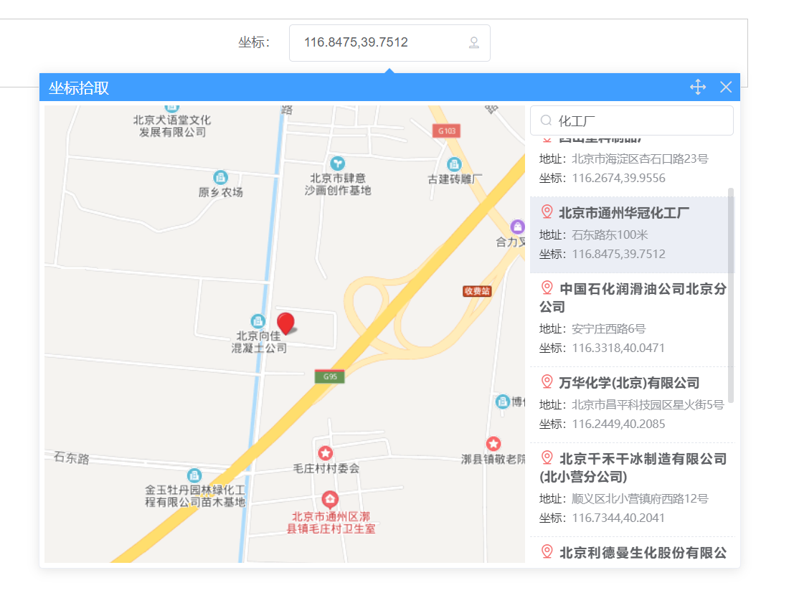

# NetModular-UI-Map

NetModular 前端地图组件库，基于百度地图+ElementUI

## 安装

```
npm install -S netmodular-ui-map
```

## 注册

```js
import Vue from 'vue'
import App from './App.vue'
import router from './router'
import store from './store'
import ElementUI from 'element-ui'
import 'element-ui/lib/theme-chalk/index.css'
import NmMap from '../packages/components'

Vue.config.productionTip = false

Vue.use(ElementUI)
Vue.use(NmMap, { ak: '百度ak' })

new Vue({
  router,
  store,
  render: h => h(App)
}).$mount('#app')
```

## 坐标拾取组件

```html
<template>
  <div class="home" style="width:800px;margin:0 auto;border:1px solid #ccc;padding:5px;">
    <el-form inline>
      <el-form-item label="坐标：">
        <nm-map-picking-coord v-model="value" type="primary" />
      </el-form-item>
    </el-form>
  </div>
</template>

<script>
  export default {
    name: 'home',
    data() {
      return {
        value: {
          lng: 116.4,
          lat: 39.91
        }
      }
    },
    methods: {}
  }
</script>
```


